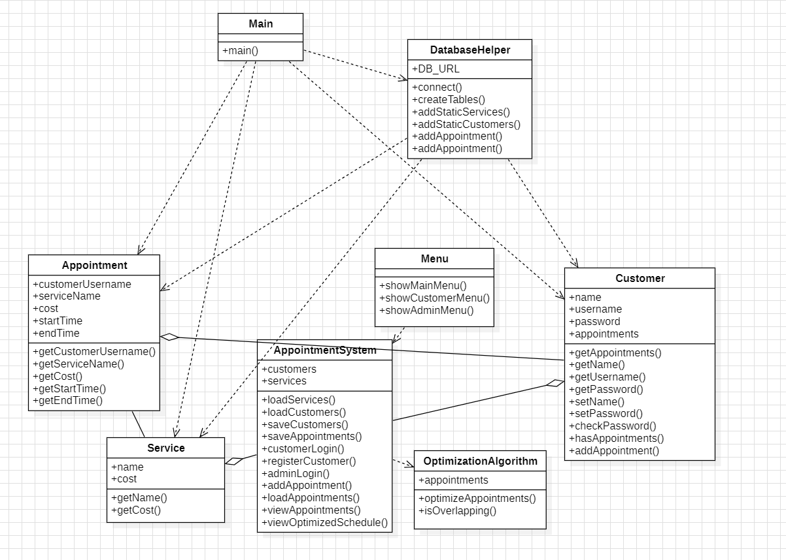

# BookIt

Η BookIt είναι μία εφαρμογή βέλτιστης κατανομής των ραντεβού μίας επιχείρησης. Πιο συγκεκριμένα, προσφέρει τη δυνατότητα στους πελάτες να στείλουν, εύκολα και γρήγορα, αιτήματα για όποια υπηρεσία επιθυμούν, βάζοντας συνοπτικά βασικές λεπτομέρειες όπως το όνομά τους καθώς και το εύρος ωρών που επιθυμούν. Στο σημείο αυτό, η εφαρμογή επεξεργάζεται τα αιτήματα των πελατών και παράγει την καλύτερη κατανομή των ραντεβού για την επιχείρηση με κύριο στόχο την επιλογή των αιτημάτων που θα προσφέρουν το μεγαλύτερο δυνατό κέρδος σε αυτή.

## Πίνακας Περιεχομένων
- [Οδηγίες μεταγλώτισης Προγράμματος](#οδηγίες-μεταγλώτισης-προγράμματος)
- [Οδηγίες εκτέλεσης προγράμματος](#οδηγίες-εκτέλεσης-προγράμματος)
- [Οδηγίες χρήσης](#οδηγίες-χρήσης)
- [Διάγραμμα UML](#διάγραμμα-uml)
- [Δομή περιεχομένου του αποθετηρίου](#δομή-περιεχομένου-του-αποθετηρίου)
- [Δομές δεδομένων](#δομές-δεδομένων)

## Οδηγίες μεταγλώτισης Προγράμματος

Για να εκτελέσετε τον κώδικα, πρέπει αρχικά να τραβήξετε όλα τα αρχεία του κώδικα σε έναν φάκελο στον υπολογιστή σας: Ανοίγετε το cmd και εκτελείτε την εντολή: git clone https://github.com/elenaxenouu/BookIt.git. Στη συνέχεια αφού βεβαιωθείτε ότι βρίσκεστε στον φάκελο BookIt που δημιουργήθηκε γράφετε την εντολή: mvn clean package.

 ## Οδηγίες εκτέλεσης προγράμματος

Για την εκτέλεση του προγράμματος χρειάζεται αρχικά να ανοίξετε το cmd και να κανετε cd στον φάκελο target ο οποίος βρίσκεται μέσα στον φάκελο στον οποίο νωρίτερα αποθηκεύσατε την εφαρμογή. Αφού βεβαιωθείτε ότι βρίσκεστε στον φάκελο target εκτελείτε την εντολή: java -jar appointments-system-1.0-SNAPSHOT.jar

## Οδηγίες χρήσης

Κατά την εκτέλεση του προγράμματος στο cmd σας ζητείται να βάλετε ορισμένα inputs ανάλογα με τα στοιχεία που ζητούνται στην οθόνη. Σε περίπτωση εσφαλμένων απαντήσεων το πρόγραμμα θα σας κατευθύνει για την εισαγωγή σωστών δεδομένων.

## Διάγραμμα UML

## Δομή περιεχομένου του αποθετηρίου
Στο main branch της ομάδας βρίσκονται οι κλάσεις που εν τέλη χρησιμοποιήθηκαν στο πρόγραμμα μας. Συνήθως δουλεύαμε σε υποομάδες, και πολλές φορές στον τοπικό υπολογιστή, εφόσον ο κώδικας που είχε ανατεθεί σε κάθε μέλος ήταν σωστός, έγινε push στο repository. Ορισμένα μέλη δημιούργησαν branches, αλλά δεν αποτέλεσε τον βασικό τρόπο συνεργασίας μας.

## Δομές δεδομένων 

Κατά την εκτέλεση της εφαρμογής δημιουργείται μία βάση δεδομένων η οποία περιέχει 3 βασικούς πίνακες για την αποθήκευση δεδομένων. Η βάση περιέχει τις υπηρεσίες, μερικούς χρήστες και αποθηκεύει κάθε πελάτη που θα δημιουργεί ο χρήστης στο σύστημα αλλά και κάθε ραντεβού.
